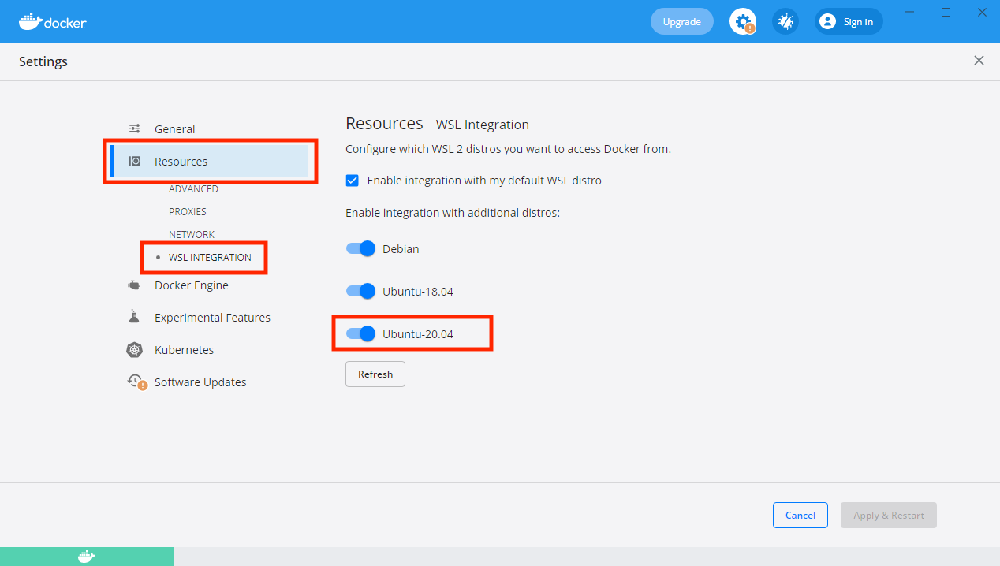
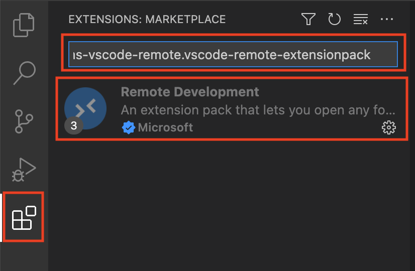
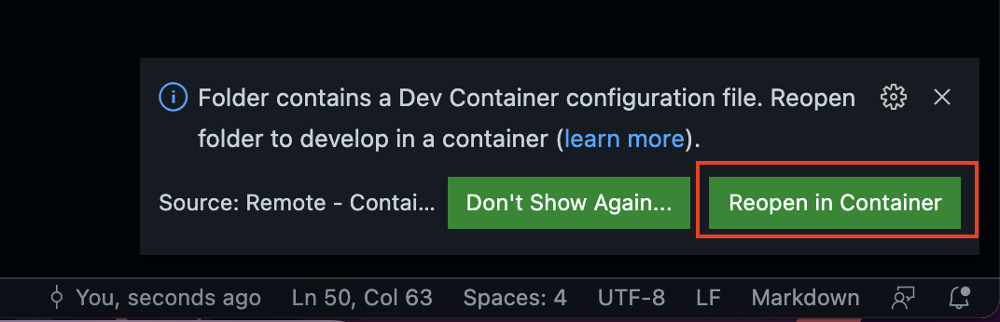

## DragonEye

1. [Prerequisites](#prerequisites)
1. [Running dev container](#running-dev-container)
1. [Bootstraping developement environment](#bootstraping-developement-environment)
1. [Updating requirements.txt](#updating-requirements.txt)
1. [Static code analysis](#static-code-analysis)
1. [Running tests](#running-tests)

## Prerequisites

### Linux

1. One of officially supported distros:
    - Ubuntu 20.04 LTS;
    - WSL Ubuntu 20.04 LTS;
1. Installed Python, version 3.9;
1. Installed Docker;
1. Installed GNU Make;


## Running dev container

This repository is configured to have ability to live inside dev container (using [Visual Studio Code](https://code.visualstudio.com)).

### Prerequisites

1. *NVidia Container Toolkit* can be installed using `make install-container-toolkit` or using official guides linked in the sections below.
1. If you don't have NVidia GPU, you still can use dev container, but make sure to comment out the following line in the `.devcontainer/devcontainer.json`:

```json
    "runArgs": [ "--gpus=all" ],
```

#### Linux (Ubuntu 20.04 LTS)

*This guid might work for other Ubuntu based distros, but there were issues with installing NVidia Container Toolkit on Pop!_OS*

1. Installed VSCode
1. Newest driver (use at least version `470.86`)
1. Installed Docker Desktop
1. Installed [NVidia Container Toolkit](https://docs.nvidia.cřom/datacenter/cloud-native/container-toolkit/install-guide.html)

#### Windows

1. Installed VSCode
1. Newest GPU driver (use at least version `497.09`)
1. Installed Ubuntu 20.04 LTS distro
1. Installed Docker Desktop
1. Installed [NVidia Container Toolkit for WSL](https://docs.nvidia.com/cuda/wsl-user-guide/index.html#ch05-running-containers)

Make sure that you enabled Docker integration with *Ubuntu 20.04 LTS* WSL distro: 



### Remote Developement extension

1. In Visual Studio Code, install *Remote Developement* extension
    1. Open Visual Studio Code
    1. From the left menu bar select extensions
    1. Search for `ms-vscode-remote.vscode-remote-extensionpack`
    1. Install it



### Reopen in dev container

If all previous steps were finished successfully, you should be able to reopen Visual Studio Code and see the following prompt in right bottom corner of Visual Studio Code:



Click button labeled *Reopen in Container* and wait for the Contianer to build. This might take some time.

### Done

If all steps were finished with success, you should see this in your left corner:


You can now proceed to next section - [Bootstraping developement environment](#bootstraping-developement-environment).

## Bootstraping developement environment

The general flow of bootstraping looks like this:

1. Installing third party dependecies using package managers (*apt-get*) and install script;
1. Installing special dependencies for specific systems from `bootstrap.toml`;
1. Installing dependencies from `requirements.txt`;

If you want to have your environment set with default libraries hassle free and easy, simply run the following command from root of the project:

```bash
make deps
```

## Updating `requirements.txt`

As we blacklist few dependencies from appearing in `requirements.txt`, you need to use our custom script to update it.

In order to create proper `requirements.txt` file, run:

```sh
make freeze
```

## Static code analysis

### flake8

Our code needs to pass the quality check, that ensures that standards are preserved. To achieve this, we are using *flake8*. To run *flake8* verification type the following command in the terminal

```sh
make flake
```

### autopep8

Some issues found by *flake8* can be fixed by *autopep8*. To run *autopep8* type the following command in the terminal:

```sh
make autopep
```

## Running tests

### Tests on your environment

To run tests on your local environment type the following command in the terminal:

```sh
make test
```

### Testing local version of CI

To run tests on isolated environment inside Docker type the following command in the terminal:

```sh
make local-ci
```

### Automated tests in cloud

Every pull request is tested on the *Drone.CI*. Those tests should be identical to the local version of CI mentioned above, but might take lot longer to run. If you think all those test can run faster on your own machine, simply run `make local-ci` before opening pull request, to verify all potential issues.
